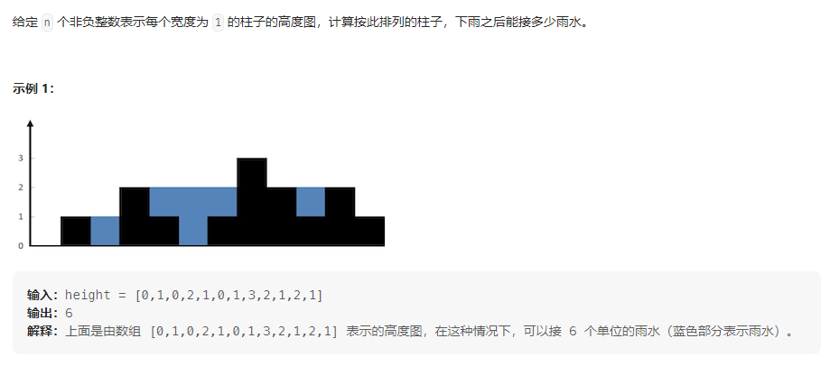

# 32.给你一个只包含 `'('` 和 `')'` 的字符串，找出最长有效（格式正确且连续）括号子串的长度。

2022.11.29字节实习一面  困难题，感觉技巧性偏多

示例：

```
输入：s = "((())"
输出：4
解释：最长有效括号子串是 "(())"
```

示例：

```
输入：s = ")()())"
输出：4
解释：最长有效括号子串是 "()()"
```

通过上面的示例可知：所谓有效括号，并不一定是一个整体，比如`((()))`这种，而是`()()`这种并列型的括号也算是有效括号，所以我们遍历找子有效括号的时候，不能用`)`的序号减去`(`的序号得到有效括号的长度，因为这样对于并列型括号是不对的，我们应该用`)`的序号减去**有效区间起点**，这里的区间就是指子有序括号，比如`")()())"`的中间的`()()`就是一个有效区间。

上面我们明确了题目的意思之后，难点就在于如何来记录这个区间了。

首先对于这种括号匹配的题目，毋庸置疑使用一个数组当作栈，然后用栈方法`pop`和`push`来进行操作。

首先确定核心逻辑：拿`)`的序号减去栈顶（区间起点）得到有效括号的长度，所以如何设计才能**让栈顶始终为区间起点**就是解决的关键。

* 因为要让栈顶为区间起点，所以我们设计了让`(`无脑进栈的情况下，遇见`)`就得让栈顶出栈，这样就可以把结合成功的括号排出栈外，保证栈顶序号为区间起点

* 初始化栈顶为`-1`，这样对于正常情况下的括号整体`(())`和并列括号`()()`，能满足`)`的序号减去`-1`就是区间长度
* 对于`)))`这种情况，我们应该修改区间起点，因为对于`)`我们的第一部逻辑就是`stack.pop();`，这样会导致栈空，所以判断，如果栈空，我们就让此时正在处理的`)`的序号入栈去做区间起点
* 对于`(((`这种情况，我们没必要刻意去处理，因为我们设计的逻辑就是栈顶为区间起点。对于`(`我们无脑入栈，我们取区间起点始终是在栈顶取，所以不影响

这里我的代码实现是：

~~~js
/**
 * @param {string} s
 * @return {number}
 */
var longestValidParentheses = function(s) {
    let maxLength = 0;
    let temp = 0;
    let stack = [];
    stack.push(-1);
    for(let i = 0;i < s.length; i ++) {
        if(s[i] == "(") {
            stack.push(i);
        }else {
            stack.pop();
            if(stack.length === 0) {
                stack.push(i);
            }
            /*
            	每次遇见`)`时会更新temp，更新temp时就判断是否超过了全局最大值
            */
            temp = i - stack[stack.length - 1];
            if(temp > maxLength) {
                maxLength = temp;
            }
        }
    }
    return maxLength;
};
~~~

说不上来学到了什么，感觉只学会了这个题目的这一种方法，这种方法设计能力需要锻炼

# 42.接雨水



解法核心就是遍历整个数组，累计横向上每个位置接的雨水量

每一个柱子接的水 = min（左边最高的柱子， 右边最高的柱子） - 当前柱子的高度—简单理解就是木桶效应，这个柱子存多少水取决于两侧最矮的柱子多高

这个柱子能积水的前提是左边和右边都有比这个柱子高的柱子

按照上面的逻辑：

~~~js
/**
 * @param {number[]} height
 * @return {number}
 */
var trap = function(height) {
    let sum = 0;
    for(let i = 0;i < height.length;i ++) {
        /*
        	left 和 right 为布尔型变量，意思是判断height数组中左边和右边有没有比height[i]大的数
        	这里先用slice切割数组，然后用find方法判断数组中是否存在满足某种条件的数据
        */
        let left = height.slice(0, i).find((value) => value > height[i]);
        let right = height.slice(i+1, height.length).find((value) => value > height[i]);
        if(left && right) {
            /*
            	Math.max搭配数组的拓展运算符实现寻找数组的最大值
            */
            sum += Math.min(Math.max(...height.slice(0, i)), Math.max(...height.slice(i+1, height.length))) - height[i];
        }
    }
    return sum;
};
~~~

优化思路：每个位置不去判断是否两侧有比当前位置高的柱子，而是都按照积水公式进行计算，如果两侧任意一侧没有比当前位置的高的柱子，那么这个位置的积水量的计算值为负数，所以求和时省略负数即可。

# 50.实现 pow(*x*, *n*)，即计算 `x` 的整数 `n` 次幂函数（即，`xn` ）。

## 1.暴力（原创）：

**暴力（时间超限），核心思路就是for循环n次，每次都乘个x**，最后返回的时候考虑负数幂次的情况。

~~~js
var myPow = function(x, n) {
    if(n === 0) return 1;
    let x_origin = x;
    //通过Math.abs获取n的绝对值
    let absoluteN = Math.abs(n);
    for(let i = 1;i < absoluteN; i++ ) {
        x = x * x_origin;
    }
    return n > 0 ? x : 1 / x;
};
~~~

时间复杂度：`O(n)`

空间复杂度：`0(1)`

## 2.分治法（快速幂）（题解）：

~~~js
var myPow = function(x, n) {
    if(n === 1) return x;
    if(n === 0) return 1;
    if(n < 0) {
        x = 1/x;
        n = Math.abs(n);
    }
    //n为偶数
    if(n % 2 === 0) {
        return myPow(x*x, n/2);
    } else {
        return x*myPow(x*x, Math.floor(n/2));
    }
};
~~~

时间复杂度：`0(logn)`，一个数的n次幂每次函数体执行都变成另一个数的n/2次幂，哪个数的幂这个数多大不重要，因为我们函数结束条件是n决定的，n足够小，函数才结束。所以经过logn次函数体执行，n就变成1了，也就是标志递归结束。然后每次函数体的执行，也就是这个规模缩小的过程，所花费的时间是单位1，执行logn次，所以时间复杂度就是`O(logn)`

空间复杂度：`0(logn)`：递归栈的深度。

方法收集：

* `Math.abs(n)`：获取n的绝对值
* `Math.pow(n,m)`：获取n的m次幂

# 53.给你一个整数数组 `nums` ，请你找出一个具有最大和的连续子数组（子数组最少包含一个元素），返回其最大和。

**子数组** 是数组中的一个连续部分

**示例 1：**

```
输入：nums = [-2,1,-3,4,-1,2,1,-5,4]
输出：6
解释：连续子数组 [4,-1,2,1] 的和最大，为 6 。
```

## 1.核心思想其实与动态相似（原创）：

从头到尾遍历一遍nums，不断更新最大和

我们需要借助一个beforeSum来记录当前指针位置之前连续项的和。

贪心思想：指针新遍历一个值的时候，**有可能更新最大和**的情况有两种：

* beforeSum大于零，所以我们把当前项加上beforeSum
* beforeSum小于零，当前项自身

这个beforeSum是帮助当前项“冲击“最大和的，所以如果曾经的beforeSum小于零，那么指针新考察过一个项之后，就把beforeSum换成这个刚考察的项即可；如果beforeSum大于零，它就对于”冲击“最大和有帮助，所以我们要保留它并累加上当前项。

~~~js
/**
 * @param {number[]} nums
 * @return {number}
 */
var maxSubArray = function(nums) {
    let currentMax = nums[0];
    let beforeSum = nums[0];
    for(let i = 1;i < nums.length;i ++) {
        if(beforeSum<0) {
            //beforeSum小于零，可能产生的最大和：nums[i]
            if(nums[i] > currentMax) {
                currentMax = nums[i];
            }
            beforeSum = nums[i];
        }else {
            //beforeSum大于零，可以产生的最大和：beforeSum+nums[i]
            beforeSum += nums[i];
            if(beforeSum > currentMax) {
                currentMax = beforeSum;
            }
        }
    }
    return currentMax;
};
~~~

* 时间复杂度：我们只遍历了一次数组，所以`0(n)`

* 空间复杂度：我们只借助了两个变量，使用了常数空间，所以`O(1)`

## 2.动态规划

定义子问题：以`nums`数组中第`i`项结尾的子数组的最大和记为`f(i)`

**`f(i) = max{(f(i-1)+nums[i]), nums[i]}`**

所以遍历nums数组时，就用`nums[i]`表示`f(i)`：如果nums[i-1] > 0，那么f(i) = nums[i] = nums[i-1] + nums[i]

~~~js
/**
 * @param {number[]} nums
 * @return {number}
 */
var maxSubArray = function(nums) {
    let currentMax = nums[0];
    for(let i = 1;i < nums.length;i ++ ) {
        currentMax = Math.max((nums[i] + nums[i - 1]), nums[i], currentMax);
        if(nums[i-1] > 0) {
            nums[i] += nums[i - 1];
        }
    }
    return currentMax;
};
~~~

我感觉和方法一思想完全相同，只是说我们直接利用了nums数组本身来记录方法一中的beforeSum。

时空复杂度也是`O(n)`和`O(1)`

# 54.给你一个 `m` 行 `n` 列的矩阵 `matrix` ，请按照 **顺时针螺旋顺序** ，返回矩阵中的所有元素

```
输入：matrix = [[1,2,3],[4,5,6],[7,8,9]]
输出：[1,2,3,6,9,8,7,4,5]
```

## 1.模拟法

题目要的数组就是我们由外到内转圈的遍历matrix出来的，那么我们就进行遍历：

### 两个技巧：

* 构造标记（标记是否遍历过某位置）数组时，构造的标记数组`matrixCopy`比原数组大一圈，好处就是遍历`matrix`的时候，如果不大一圈，我们在走最外圈的时候走完一条边的判断条件就是数组不越界，而到了内圈标记数组才能发挥作用：判断条件根据标记数组得知有没有走过。但是我们如果标记数组构造的大一圈，就可以**从头到尾统一判断条件：根据标记数组看是否走过。**（注意标记数组和对应原数组位置坐标有一个单位的偏移即可）

* 第二个技巧：while循环的结束条件怎么写：

  * 首先模拟走圈的时候，最外层有一个while循环，内层有四个while循环，对应一圈的四个边，不管是外层的while还是内层的while，写代码的时候我都并没有直接写出来while的结束条件，而都是`while(true)`，回头看来，这个操作属实可圈可点。

  * 先说最外层的while，从结构来看，while的退出是内部满足了一定条件之后`break`，从逻辑来看，之后遍历完一条边，转换到下一条边的时候，如果没位置（matrixCopy为false）,就说明整个遍历完成。不管四个方向向哪走的时候，都有可能满足最外层的退出条件，所以总结：`while(true)`的结构内`break`可以让while退出的逻辑变得简单（不用高度凝练的写在while后面的括号里）

  * 内层的while退出，并不和外层一样很多种退出的场景，内层的while就是完成一定的任务：走完一条边。所以内层这里`while(true)`的目的和上面不同。内层while的结束条件就是下一个位置没发走了（`matrixCopy[x][y]`为`false`），while内部肯定是每次都沿着遍历的方向让坐标变化一个单位，但是这里我们不盲目每次都加一，因为如果每次都稳定加一，然后while内部判断条件是`matrixCopy[x][y]`为`true`，就会造成最后一下坐标变化之后虽然坐标不满足while的条件了，while推出了，但是相当于多加了一下，往后坐标也不能用了，就好比for循环，每次i++，然后最后一次不满足条件了，此时i就已经“走远了"。所以我们在while内部进行退出判断：先预先判断一下坐标移动之后的状态，然后再移动：

    ~~~js
    while(true) {
    	...
        //预先判断移动之后的状态是否合理再移动
        if(matrixCopy[x-1][y]) {
            x -= 1;
        }else {
            break;
        }
    }
    ~~~

代码：

~~~js
/**
 * @param {number[][]} matrix
 * @return {number[]}
 */
var spiralOrder = function(matrix) {
    let ans = [];
    let matrixCopy = new Array(matrix.length + 2);
    for(let i = 0;i < matrixCopy.length; i ++) {
        matrixCopy[i] = new Array(matrix[0].length + 2);
    }
    
    for(let i = 0;i < matrixCopy.length;i ++) {
        for(let j = 0;j < matrixCopy[0].length;j ++) {
            //初始化标记数组
            /*
            	根据边界条件特殊处理最外面一圈
            	最外面一圈设置为false，表示不能遍历
            */
            if((i == 0) || (i == matrixCopy.length-1) || (j == 0) || (j == matrixCopy[0].length-1)) {
                matrixCopy[i][j] = false;
            }else {
                matrixCopy[i][j] = true;
            }
        }
    }
    let x = 1;
    let y = 1;
    while(true) {

        //向右走
        //判定位置总结while中判定，就会导致状态已经错误了,或者说目前的状态修改不是盲目每轮都修改，而是只有保证状态修改后正确再修改
        while(true) {
            ans.push(matrix[x-1][y-1]);
            matrixCopy[x][y] = false;
            if(matrixCopy[x][y+1]) {
                y += 1;
            }else {
                break;
            }
        }
        //改变坐标位置为向下的起点
        if(matrixCopy[x+1][y]) {
            x = x+1;
        }else {//如果没法转弯了，那就是遍历完成了
            break;
        }

        //向下走
        while(true) {
            ans.push(matrix[x-1][y-1]);
            matrixCopy[x][y] = false;
            if(matrixCopy[x+1][y]) {
                x += 1;
            }else {
                break;
            }
        }
        if(matrixCopy[x][y-1]) {
            y = y-1;
        }else {
            break;
        }

        while(true) {
            ans.push(matrix[x-1][y-1]);
            matrixCopy[x][y] = false;
            if(matrixCopy[x][y-1]) {
                y -= 1;
            }else {
                break;
            }
        }
        if(matrixCopy[x-1][y]) {
            x = x-1;
        }else {
            break;
        }

        //向上走
        while(true) {
            ans.push(matrix[x-1][y-1]);
            matrixCopy[x][y] = false;
            if(matrixCopy[x-1][y]) {
                x -= 1;
            }else {
                break;
            }
        }
        if(matrixCopy[x][y+1]) {
            y = y+1;
        }else {
            break;
        }
    }
    return ans;
};
~~~

时空复杂度都是：`O(mn)`，都是两层循环

# 55.跳跃游戏

给定一个非负整数数组 nums ，你最初位于数组的 第一个下标 。

数组中的每个元素代表你在该位置可以跳跃的最大长度。

判断你是否能够到达最后一个下标。

**示例 1：**

```
输入：nums = [2,3,1,1,4]
输出：true
解释：可以先跳 1 步，从下标 0 到达下标 1, 然后再从下标 1 跳 3 步到达最后一个下标。
```

我觉着这个题最重要的就是悟到题目的核心：说白了，只要不被0卡住，就一定能到最后。

**如果被题目的标题（跳跃游戏）所误导，用模拟跳跃的方法去解题，那么事倍功半。**

## 1.贪心法—遍历更新

**对于每个位置，我们都跳最远，更新我们能到达的最远距离（贪心）**，遍历完之后，只需要比较我们能到达的最远距离是否够用即可。

~~~js
/**
 * @param {number[]} nums
 * @return {boolean}
 */
var canJump = function(nums) {
    let lengthMax = 0
    for(let i = 0; i < nums.length-1; i ++) {
        /*
        	更新lengthMax有个前提条件:
        		目前的我们能到达的位置lengthMath要大于位置i
        */
        if(lengthMax >= i && (i + nums[i]) > lengthMax) {
            lengthMax = i + nums[i];
        }
    }
    if(lengthMax >= (nums.length-1)) {
        return true;
    }
    return false;
};
~~~

时间复杂度：`O(n)`，遍历一次数组

空间复杂度：`O(1)`

# 56.合并区间

以数组 intervals 表示若干个区间的集合，其中单个区间为 intervals[i] = [starti, endi] 。请你合并所有重叠的区间，并返回 一个不重叠的区间数组，该数组需恰好覆盖输入中的所有区间 。

**示例 1：**

~~~
输入：intervals = [[1,3],[2,6],[8,10],[15,18]]
输出：[[1,6],[8,10],[15,18]]
解释：区间 [1,3] 和 [2,6] 重叠, 将它们合并为 [1,6].
~~~

## 1.排序+遍历

首先先把intervals中的区间按照区间起点的升序排列目的是方便判断相邻区间是否有重叠，这样遍历intervals数组考察每一个区间，如果新考察的区间左边界小于结果集最后一个区间的右边界，说明存在重叠的可能，如果新考察的区间的右边界要大于结果集最后一个区间的右边界，即可更新结果集中的最后一个区间的右边界；如果没有重叠的可能，就直接把新考察的区间放进结果集。

~~~js
/**
 * @param {number[][]} intervals
 * @return {number[][]}
 */
var merge = function(intervals) {
    let ans = [];
    //升序排序
    intervals.sort((a, b) => a[0] - b[0]);

    //循环开始前初始化:先放进去第一个元素，这样从第二考察区间开始就有比较的对象了
    ans.push(intervals[0]);

    for(let i = 1;i < intervals.length; i ++) {
        //如果新考察的区间的起点小于结果集最后一个区间的终点，那么有可能重叠（还需要比较新考察区间的终点是否大于结果集最后一个区间的终点）
        if(intervals[i][0] <= ans[ans.length-1][1]) {
            if(intervals[i][1] > ans[ans.length-1][1]) {//如果存在重叠，那么更新结果集的区间的终点即可
                ans[ans.length-1][1] = intervals[i][1];
            }
        }else {//两个区间没有交集，不存在重叠的可能
            ans.push(intervals[i]);
        }
    }
    return ans;
};
~~~

时间复杂度：`O(nlog n)`，其中 n 为区间的数量。排序`O(nlog n)`>构造答案`0(n)`

空间复杂度：`O(nlog n)`，其中 nn 为区间的数量。**这里计算的是存储答案之外，使用的额外空间**。`O(nlog n)` 即为排序所需要的空间复杂度。

# 200.岛屿的数量

给你一个由 `'1'`（陆地）和 `'0'`（水）组成的的二维网格，请你计算网格中岛屿的数量。

岛屿总是被水包围，并且每座岛屿只能由水平方向和/或竖直方向上相邻的陆地连接形成。

此外，你可以假设该网格的四条边均被水包围。

**示例 1：**

```
输入：grid = [
  ["1","1","1","1","0"],
  ["1","1","0","1","0"],
  ["1","1","0","0","0"],
  ["0","0","0","0","0"]
]
输出：1
```

**示例 2：**

```
输入：grid = [
  ["1","1","0","0","0"],
  ["1","1","0","0","0"],
  ["0","0","1","0","0"],
  ["0","0","0","1","1"]
]
输出：3
```

## 1.沉岛法

我们遍历整个地图，如果遇见了`"1"`，我们就算遇见了一个岛屿，岛屿数量＋1，但是我们在继续遍历下一个位置之前，需要把与这个位置相连的陆地都变成`"0"`，也就是所谓的沉岛

~~~js
/**
 * @param {character[][]} grid
 * @return {number}
 */
var numIslands = function(grid) {
    let ans = 0;
    for(let i = 0;i < grid.length; i ++) {
        for(let j = 0;j < grid[0].length;j ++) {
            if(grid[i][j] === "1") {
                ans ++;
                turnZero(i, j, grid);
            }
        }
    }
    return ans;
};
function turnZero(x, y, grid) {
    if(x < 0 || x >= grid.length || y < 0 || y >= grid[0].length || grid[x][y] === '0') return;
    grid[x][y] = "0";
    turnZero(x - 1, y, grid);
    turnZero(x + 1, y, grid);
    turnZero(x, y - 1, grid);
    turnZero(x, y + 1, grid);
}
~~~

